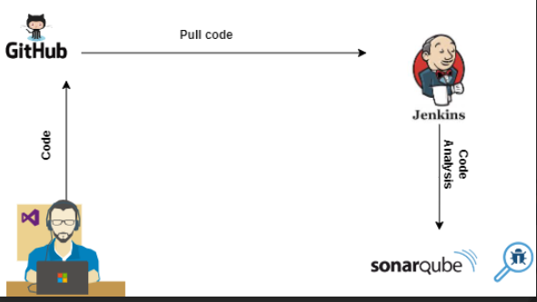
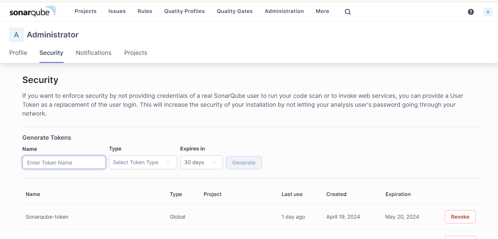
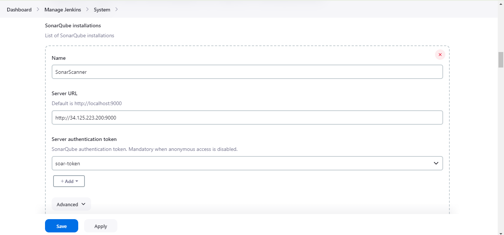
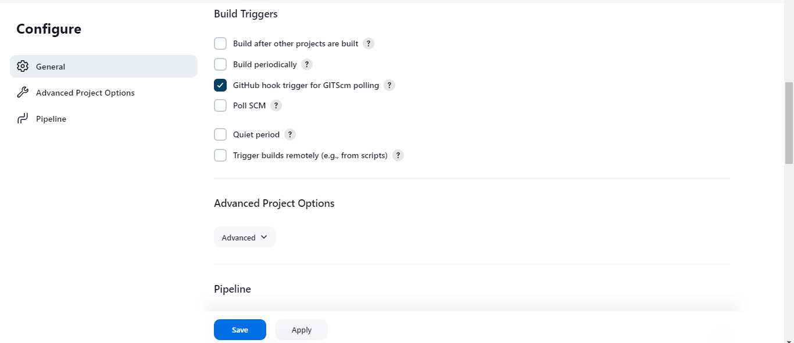
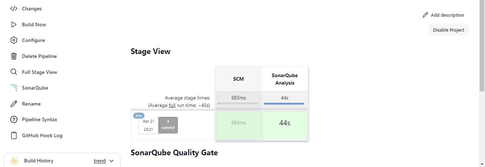
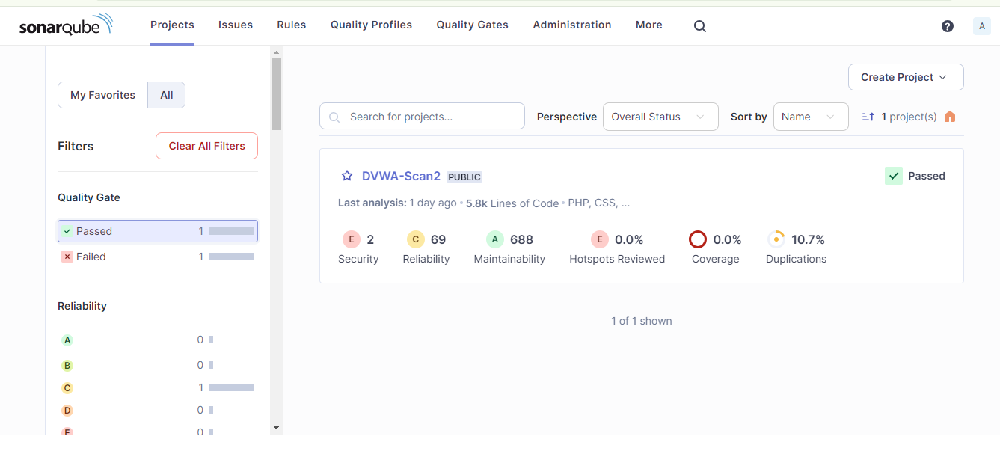

# Continuous Integration Documentation

## Overview

This document outlines the process of integrating GitHub, Jenkins, and SonarQube to automate code scanning and generate reports for code quality and security vulnerabilities. The Damn Vulnerable Web Application (DVWA) repo will be the sample application codebase for scanning. 

## Architecture



### Components

1. **GitHub**: Version control repository hosting our codebase.
2. **Jenkins**: Automation server for continuous integration and deployment.
3. **SonarQube**: Platform for static code analysis to detect code smells, bugs, and security vulnerabilities.

## Setup Instructions

### Pre-requisites

- [ ] 2 VM instances in Google Cloud Platform (GCP) with Debian 11/ Ubuntu image (one for jenkins, the other for sonarqube).
- [ ] Install docker on the VMs
- [ ] Access to GitHub repository containing the codebase,and create a [webhook](https://docs.github.com/en/webhooks/using-webhooks/creating-webhooks) to subscribe to specific events that occur on your GitHub repo.
.


### Step 1: Install Jenkins

1. SSH into your Jenkins VM instance.
2. Install OpenJDK 17
3. Install Jenkins using the following commands:
   ```bash
   sudo wget -O /usr/share/keyrings/jenkins-keyring.asc \
   https://pkg.jenkins.io/debian-stable/jenkins.io-2023.key
   echo "deb [signed-by=/usr/share/keyrings/jenkins-keyring.asc]" \
   https://pkg.jenkins.io/debian-stable binary/ | sudo tee \
   /etc/apt/sources.list.d/jenkins.list > /dev/null
   sudo apt-get update
   sudo apt-get install jenkins

4. Start the Jenkins service:
   ```bash
   sudo systemctl start jenkins
   sudo systemctl enable jenkins
   sudo systemctl status jenkins
   ```

### Step 2: Install SonarQube
1.  SSH into your SonarQube VM instance.
2.  Install SonarQube using Docker:
   ```bash
docker pull sonarqube
```
3.  Run SonarQube
```bash
docker run -d --name sonarqube-db -e POSTGRES_USER=sonar -e POSTGRES_PASSWORD=sonar -e POSTGRES_DB=sonarqube postgres:alpine
```


```bash
docker run -d --name sonarqube -p 9000:9000 --link sonarqube-db:db -e SONAR_JDBC_URL=jdbc:postgresql://db:5432/sonarqube -e SONAR_JDBC_USERNAME=sonar -e SONAR_JDBC_PASSWORD=sonar sonarqube
```
4. Access SonarQube at `http://sonarqube-vm-ip:9000` and set up the admin credentials.
5.  Create a local project and enter the project name, and select branch.
6.  select global setting and create project.
7.  Analyze with Jenkins and select github as your devops platform.
8.  copy your project key.
#### Creating a SonarQube Token

To integrate SonarQube with Jenkins, you'll need to create an authentication token in SonarQube and configure Jenkins to use it for authentication.

Follow these steps to create a token:

1. Log in to your SonarQube instance as an administrator.
2. Navigate to **Administration > Security > Users**.
3. Find your user account and click on it.
4. Scroll down to the "Authentication Tokens" section.
5. Click on "Generate Tokens".
6. Provide a name for your token (e.g., "Jenkins Integration").
7. Click on "Generate".
8. Copy the generated token.
9. **IMPORTANT:** Save the token securely. Once you navigate away from this page, you won't be able to see the token again.



Now that you have your token, you can use it in Jenkins for authentication when connecting to SonarQube.


   
### Step 3: Configure Jenkins

- Install necessary Jenkins plugins:
  - GitHub plugin
  - SonarQube Scanner plugin: **Manage Jenkins" > Manage Plugins > Available** and searching for **SonarQube Scanner**
    
- Configure Jenkins to connect to your GitHub repository.
   - create a new pipeline project, click on "New Item" on the Jenkins home page and select "Pipeline". Give your project a name and click "OK".
   - In the pipeline configuration page, scroll down to the "Pipeline" section and select "Pipeline script from SCM" as the definition. Choose "Git" as the SCM and enter the URL 
     of your GitHub repository. You can also specify the branch to use for the pipeline.
   - Save the pipeline
     
     
  
- Configure SonarQube server in Jenkins:
  - Go to **Manage Jenkins > Configure System**.
  - Under SonarQube servers, add a new server with the SonarQube URL and credentials(token).
  - Test the connection to ensure it's successful.
    

### Step 4: Create Jenkins Pipeline

1. Define a Jenkinsfile in your GitHub repository with the following pipeline steps.
```
   node {
  stage('SCM') {
    checkout scm
  }
  stage('SonarQube Analysis') {
    def scannerHome = tool 'SonarScanner';
    withSonarQubeEnv() {
      sh "${scannerHome}/bin/sonar-scanner -Dsonar.projectKey=<project.key> "
    }
  }
}
```

2. Commit and push the Jenkinsfile to your GitHub repository.
3. Ensure the github hook trigger checkbox in jenkins is ticked.
   

### Usage

1. Make code changes and push them to your GitHub repository.
2. Jenkins will automatically trigger a build when changes are detected. 
3. Jenkins will execute the pipeline defined in the Jenkinsfile, including code scanning with SonarQube.
   
5. SonarQube analysis results will be displayed, providing insights into code quality and security.
   

### Conclusion

By integrating GitHub, Jenkins, and SonarQube, we have established a robust continuous integration pipeline that automates code scanning and reporting. This ensures the quality and security of our codebase with every change, enabling faster delivery of reliable software.

